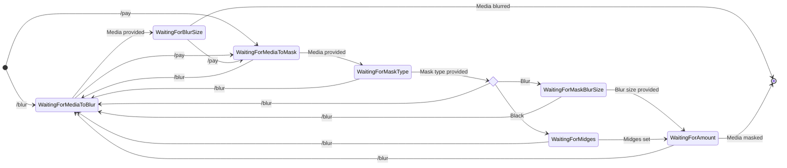

This bot's logic could be roughly described with this FSM:

```mermaid
stateDiagram
    direction LR

    [*] --> WaitingForMediaToBlur: /blur
    [*] --> WaitingForMediaToMask: /pay

    WaitingForMediaToBlur --> WaitingForBlurSize: Media provided

    WaitingForMediaToMask --> WaitingForMaskType: Media provided

    state MaskType <<choice>>
    WaitingForMaskType --> MaskType: Mask type provided
    MaskType --> WaitingForMaskBlurSize: Blur
    MaskType --> WaitingForMidges: Black

    WaitingForMaskBlurSize --> WaitingForAmount: Blur size provided
    WaitingForMidges --> WaitingForAmount: Midges set

    WaitingForBlurSize --> [*]: Media blurred
    WaitingForAmount --> [*]: Media masked

    WaitingForMediaToMask --> WaitingForMediaToBlur: /blur
    WaitingForMaskType --> WaitingForMediaToBlur: /blur
    MaskType --> WaitingForMediaToBlur: /blur
    WaitingForMaskBlurSize --> WaitingForMediaToBlur: /blur
    WaitingForMidges --> WaitingForMediaToBlur: /blur
    WaitingForAmount --> WaitingForMediaToBlur: /blur

    WaitingForMediaToBlur --> WaitingForMediaToMask: /pay
    WaitingForBlurSize --> WaitingForMediaToMask: /pay
```
